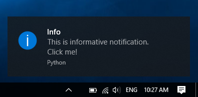
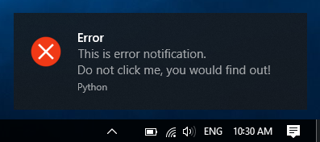
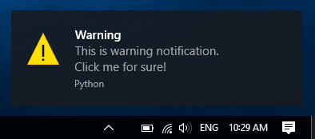

.. _examples:

=============
Code examples
=============

This page contains few examples of usage.

Basic notification
==================

Following example show basic usage of zroya. First, :py:class:`zroya.TrayIcon` instance is created. It
is the main center for all notification manipulation. As long as this object exists, you may
create notifications, receive events and run callbacks.

Second line creates simple notification with title and text. Since icon and callback parameters
are omnited, info icon will be used with no events attached to this notification.

.. code-block:: python

    from zroya import TrayIcon

    nc = TrayIcon() # 1
    nc.create("Info", "This is informative notification.\nClick me!") # 2

Notification
============

Because of Windows limitations, you can create only one notification at the time. If you have one notification running,
creating another one will result in TrayIcon.create method returning False.

.. code-block:: python

    # Zroya is imported, nc contains TrayIcon instance

    nc.create("Info", "This is informative notification.\nClick me!")

Events
======

Zroya supports three event types. Each one corresponds with some notification action.

First of them is `on_click`. This event is fired when user clicks on notification. It does
not depend whether it is during timeout (notification is shown over the tray bar) or after
it (notification is in Windows notification center).

`on_show` is event fired right after notification is created.

`on_hide` is the last of supported notification event. It is fired when notification is closed
by user.

You may register one or all of above mentioned events for each notification. When calling
:py:meth:`zroya.TrayIcon.create`, pass function name as value to one of `on_*`
parameters.

.. code-block:: python
    
    # zroya is imported, nc contains TrayIcon instance

    nc.create("Info", "Text does not matter now",
        on_click = on_click_callback,
        on_hide = on_hide_callback,
        on_show = on_show_callback
    )

Callbacks
---------

Each callback should be function or method of following form:

.. code-block:: python

    def callback(data):
        """
        This is general callback for zroya. 
        :param dict data:   All data used when creating corresponding notification.
        """
        
        # Your code here
        pass

Data parameter consist of following keys:

.. code-block:: python

    data = {
        "title": "Notification title",
        "message": "Original notification text",
        "icon": "Path to notification icon, or one of TrayIcon.ICON_*",
        "sound": "True/False value. Should sound be played when notification appears?"
    }

Event loop
----------

This may be the most important part of events example. Because zroya depends on win32 library,
it shares bit of its mechanics. On of them is application event loop. This loop takes care of
running corresponding actions for each event. 

Zroya uses method :py:meth:`zroya.TrayIcon.update`. It polls all waiting events,
runs user defined callbacks and then pass the execution to default Windows event handler.

You should call it periodically in your application main loop. Without is, event callbacks
won't work.

Icons
=====

For most cases, using system default `info` icon is enought. This icon will be used as default.

In other cases, you may specify, which icon should be displayed next to notification text. Zroya
offers three basic types:

:py:attr:`zroya.TrayIcon.ICON_INFO` is default icon.

:py:attr:`zroya.TrayIcon.ICON_ERROR` shows red cross:

:py:attr:`zroya.TrayIcon.ICON_WARNING` shows yellow warning sign:

Following code generates warning notification:

.. code-block:: python

    # zroya is imported, nc contains TrayIcon instance

    nc.create("Test", "Test", icon=TrayIcon.ICON_WARNING) #1

In additional to those icons, zroya supports user defined icons. Just pass absolute path to
icon file (.ico, .bmp) as `icon` parameter of :py:meth:`zroya.TrayIcon.create` method.

.. code-block:: python

    # zroya is imported, nc contains TrayIcon instance

    nc.create("Test", "Test", icon="C:\\Path\To\\My\\Image.ico") #1

Sound effects
=============

Last feature of zroya is probably muting sound for notification. When creating a new one,
passing `False` to :py:meth:`zroya.TrayIcon.create` parameter `sound` will mute
its sound.

.. code-block:: python

    # zroya is imported, nc contains TrayIcon instance

    nc.create("No Sound", "No sound for this notification", sound=False) #1