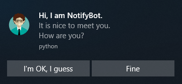
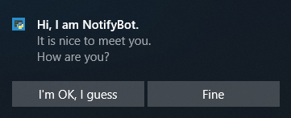

Further on templates
====================

In previous tutorial, we managed to create a notification from template. In this part, we will make the most from
templates.

Multiple lines
--------------

As I said in previous tutorial, not each :py:class:`zroya.TemplateType` supports multiple lines of text. So make
sure you pick the right one - for example :py:attr:`zroya.TemplateType.ImageAndText4`. You may set up to three lines of
text to it.

.. code-block:: python

    # zroya is imported and initialized
    template = zroya.Template(zroya.TemplateType.ImageAndText4)
    template.setFirstLine("Hi, I am NotifyBot.")
    template.setSecondLine("It is nice to meet you.")
    template.setThirdLine("How are you?")

    zroya.show(template)

At the moment, zroya supports up to three lines - each one is set by it's own function -
:py:meth:`zroya.Template.setFirstLine`, :py:meth:`zroya.Template.setSecondLine` and
:py:meth:`zroya.Template.setThirdLine`.

    Notification with three lines of text

Getting the text back
---------------------

Except functions for setting text, there are functions for getting it back from template. They are named
:py:meth:`zroya.Template.getFirstLine`, :py:meth:`zroya.Template.getSecondLine` and
:py:meth:`zroya.Template.getThirdLine` respectively.

We will use template from previous example to get second line back:

.. code-block:: python

    print(template.getSecondLine())
    #> "It is nice to meet you."

If there is no such text, empty string is returned.

Change sound
------------

It is all nice and so, but the sound Windows does when notification is created is sooo boring, right? Let's change it.

.. code-block:: python

    template.setAudio(zroya.Audio.Call4)

Sadly, there is no way to play fart sounds you recorded yesterday every time notification is created. But you can
choose from plenty of sounds defined in :py:class:`zroya.Audio` class. The bright side of the thing is, they are
available at any Windows station.

If this is not enough, you can annoy user even more with looping the sound until moved to Action Center,
or until user dismiss it in rage.

.. code-block:: python

    template.setAudio(zroya.Audio.Call4, zroya.AudioMode.Looping)

But I wouldn't recommend it. On the other hand, muting notifications may be usable a bit more:

.. code-block:: python

    template.setAudio(mode=zroya.AudioMode.Silence)

Expiration time
---------------

Notifications will stay in Action Center until you shut the application off or you manually remove them from there.
But some notifications should have shorter lifespan - for example weather reports. There is no use of the old ones.
Beside hiding them from code, :py:meth:`zroya.Template.setExpiration` comes to aid.

.. code-block:: python

    template.setExpiration(1000)

It takes a number of milliseconds after which the notification is automatically removed from Action Center.

Images
------

UI is key to user's heart. Let's make bot more friendly. Add image with :py:meth:`zroya.Template.setImage`.

.. code-block:: python

    template.setImage("./image.png")

    Isn't he cute :*

At this point, we make use of that :py:attr:`zroya.TemplateType.ImageAndText4` template type. For example
with :py:attr:`zroya.TemplateType.Text4`, this function would return False every time, because it does not support
this type.

Actions
-------

One pretty cool feature is adding actions. Those are buttons which can have attached some action to them. When user
click them, event is fired. See :doc:`callbacks`.

In this example, we add two buttons to respond question notification is asking. What a wonderful time, answering
your own questions :).

.. code-block:: python

    template.addAction("I'm OK, I guess")
    template.addAction("Fine")

    Answer the question, please.

As you probably noticed, they don't do much now. Just dismiss it. We will do something about it in the next tutorial.

Troubleshooting
---------------

**Actions fail to be added**: Actions are one of Windows 8.1+ features. If you have older system, they won't work.