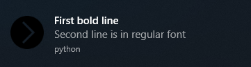

In Action
=========

This page contains code snippets with summary of zroya's abilities. See :doc:`tutorials/index` for more detailed
introduction.

Simple Notification
-------------------

.. code-block:: python

    import zroya

    zroya.init("Python", "a", "b", "c", "d")
    t = zroya.Template(zroya.TemplateType.Text1)
    t.setFirstLine("Just one bold line")
    zroya.show(t)

Multiline Notification With Image
---------------------------------

.. code-block:: python

    import zroya

    zroya.init("Python", "a", "b", "c", "d")
    t = zroya.Template(zroya.TemplateType.ImageAndText4)
    t.setFirstLine("First bold line")
    t.setSecondLine("Second line is in regular font")
    t.setImage("./files/image.png")
    zroya.show(t)

Attaching callbacks
-------------------

.. code-block:: python

    import zroya
    import time

    def onClickHandler(notification_id):
        print("Clicked!")

    zroya.init("Python", "a", "b", "c", "d")
    t = zroya.Template(zroya.TemplateType.Text1)
    t.setFirstLine("Click on me, please!")
    zroya.show(t, on_click=onClickHandler)
    time.sleep(10)
