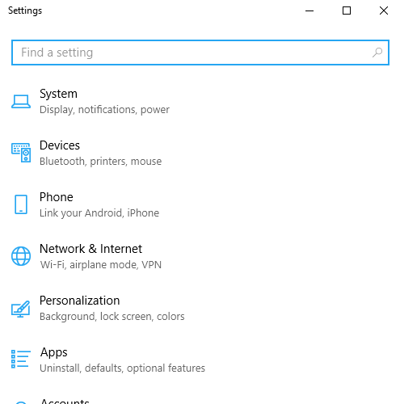

First steps
===========

This tutorial focus only on the basics. It will walk you through setting zroya up, creating template, adding attributes
to it and finally showing a notification.

Before you follow this tutorial, make sure zroya is installed. See :doc:`installation`.

.. code-block:: python

    import zroya

First thing you have to do each time you want to use zroya is to initialize it. This is
required for Windows to associate Python application with notifications.

.. code-block:: python

    import zroya

    status = zroya.init(
        app_name="NotifyBot",
        company_name="MyBotCorp",
        product_name="NoBo",
        sub_product="core",
        version="v01"
    )

    if not status:
        print("Initialization failed")

Note that all parameters of :py:func:`zroya.init` are required and they have to be strings. As you see,
:py:func:`zroya.init` returns a boolean status. Always make sure that initialization did not fail.

Notification templates
----------------------

Now you are ready to create a notification. Each one is based on a :py:class:`zroya.Template`. It holds
all information about the notification - text, image, sounds, etc.

There are some predefined template types. Think of them as a form you fill blank fields into. The simplest type is
:py:attr:`zroya.TemplateType.Text1`, which have only one field - first line. Filling anything more will result in
errors.

All types are defined in :py:class:`zroya.TemplateType` class. Select one of them and we will use it to create a
template.

.. code-block:: python

    # zroya is imported and initialized at this moment
    template = zroya.Template(zroya.TemplateType.Text1)

As you can see, you pass selected template type as a parameter to constructor of :py:class:`zroya.Template`.

Set it's text
-------------

We did create a template. But it does not hold anything. Say you want to show "Hi, how are you?" in it. Following code
will do so:

.. code-block:: python

    # template is an instance of zroya.Template
    template.setFirstLine("Hi, how are you?")

Show it to the world
--------------------

We got there, finally. It is time to show the notification. Use :py:func:`zroya.show` function and pass it **template**
as first parameter:

.. code-block:: python

    # template is an instance of zroya.Template
    zroya.show(template)

:py:func:`zroya.show` has more parameters, but they don't have to bother you at the moment. We will focus on them in
following steps of this tutorial.

If everything went right, you should register a notification showing up at the right down corner of your screen.

    Result of our hard work :)

Troubleshooting
---------------

**Calling** :py:func:`zroya.init` **failed**: This shouldn't happen. Please make sure to `report it`_. It helps me a lot
with debugging and serving you the best product.

**There is no notification!**: Make sure it is allowed for python (or for any app you are using zroya in) to create
notifications.

Head to *Settings* **=>** *System* **=>** *Notifications and Actions*. Scroll down and find Python. Set Notifications to
On.

    How to enable notifications.

.. _report it: https://github.com/malja/zroya/issues/new